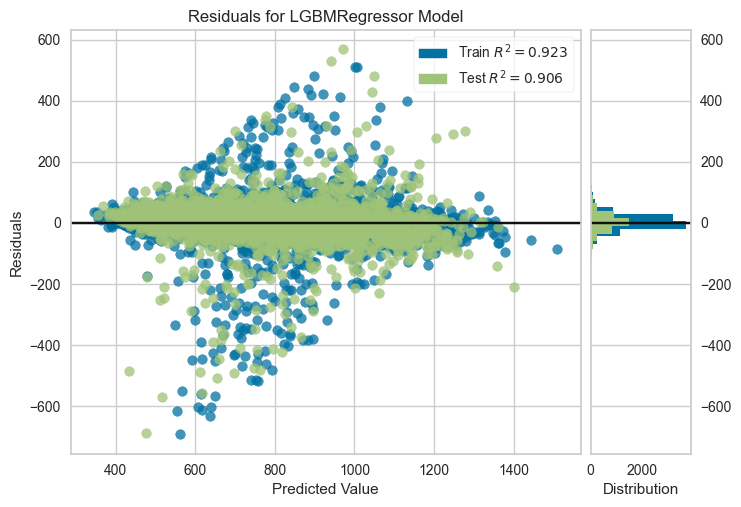

# Carbon Footprint Prediction

Predict a household's carbon footprint from lifestyle and home attributes. This project builds a regression model using PyCaret and visualizes performance and insights.

## Project Overview
- __Goal__: Estimate `carbon_footprint` from features like electricity usage, gas usage, vehicle miles, house size, water usage, insulation quality, recycling habits, diet type, etc.
- __Data__: CSV files in `dataset/`
  - `train.csv` — training data with target `carbon_footprint`
  - `test.csv` — test data without target
  - `sample_submission.csv` — format for submission
- __Notebook__: Main workflow in `CF.ipynb`
- __Best Model (from compare_models)__: LightGBM (R² ≈ 0.877, MAE ≈ 32.77, RMSE ≈ 66.23)

## Repository Structure
- `dataset/` — input CSVs
- `results/model/CF.pkl` — trained model artifact (example)
- `results/plots/` — saved figures (see below)
- `results/submission.csv` — prediction file
- `CF.ipynb` — data prep, modeling, prediction
- `requirements.txt` — project dependencies

## Key Results & Visualizations
Below are core plots stored in `results/plots/`.

### Feature Importance

### Residuals Analysis

### Learning Curve

> Tip: You can generate additional evaluation plots (Predictions vs Actual, Residuals distribution, metric summaries) directly in the notebook using the provided evaluation cells.

## Tech Stack
- pandas, numpy, scikit-learn, matplotlib, seaborn, pycaret

## Acknowlegements
- This project was developed during HackerEarth Machine Learning challenge: Earth Day
